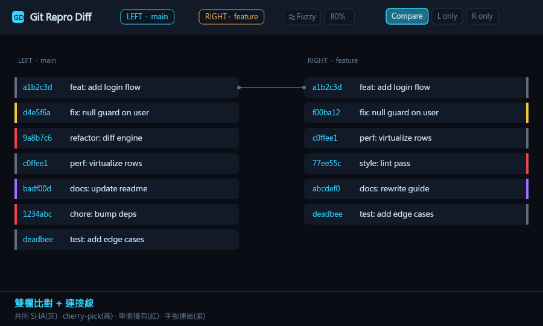

> 🌐 [English](README.md) ｜ **中文（繁體）**（你正在閱讀此版本）

# M2_GIT_DIFF（雙倉庫 Git 紀錄並排比對工具）

一個專門用來**比較兩個本機 Git 倉庫（local repro）提交歷史**的桌面工具，採用類似 GitLens / GenLen 的 HUD 深色風格。左右並排顯示兩個倉庫的 commit，並用顏色與連接線標示差異。應用程式名稱與 LOGO 為 **M2_GIT_DIFF**，顯示於工具列、視窗標題與工作列圖示。

> 原始需求摘要：左右並排顯示兩個 local repo 的 git 紀錄與 branch；兩邊相同的 commit 用灰色背景，獨有的用紅色背景，標題相同疑似 cherry-pick 的用黃色背景並用線左右對齊連結；可搜尋標題 / 內文 / SHA / 日期。

## 操作預覽



> 上方為合成示意動畫（非實機錄影），依序展示：雙欄比對與連接線、點選連線、搜尋高亮、右鍵強制背景顏色、**Fuzzy Match 內容相似度模糊配對（粉紅粗虛線）**、`Ctrl`+點選詳情浮窗與 HL 高亮、**詳情浮窗的 🌐 Web 連結（以瀏覽器開遠端 commit 頁面）**、註記導航。
> 動畫由 `scripts/make-demo-gif.mjs` 以與 `src/styles.css` 相同的配色繪製，執行 `npm run demo:gif` 可重新產生 `public/demo.gif`。

---

## 1. 功能總覽

| 功能 | 說明 | 顏色 |
| --- | --- | --- |
| 並排雙欄 | 左右各開一個本機 repo，分別顯示其 branch 與 commit 列表 | — |
| 相同 commit | 兩邊 **SHA 完全相同** | 灰色背景 |
| 各自獨有 | 只存在於單一邊的 commit | 紅色背景 |
| Cherry-pick（標題） | **標題相同但 SHA 不同**，並用線左右對齊連接 | 黃色背景＋黃色虛線 |
| Cherry-pick（內容 / patch-id） | 標題**不同**但 `git patch-id`（實際變更內容指紋）相同 → 標題被改寫的 cherry-pick 也能配對 | 黃色背景＋黃色點線 |
| **Fuzzy Match（內容相似度）** | 工具列可開關的模糊配對：當 SHA / 標題 / patch-id **都比對不上**時，比較兩個 commit **實際變更的程式碼行**，相似度（包含率）≥ 門檻（預設 **80%**，可調 0–100%）即配對。適合「TOT 把多個專案一起改、personal branch 只改其中一個專案」這種**子集**情境 | 粉紅色背景＋粉紅色粗虛線 |
| **並排比對（行內 diff）** | 選取任一已連線的配對（點連接線或已連線的列）→ 連接線上會出現 **⚡VS 比對** 膠囊鈕並預顯相似度 %。或者 **Shift+點選任意兩個 commit**（即使未連線、甚至同一欄）加入選取籃，再按 **比對**。兩者都會彈出可拖曳縮放的視窗，抓取**兩個 commit 各自的完整 unified diff**，依檔案路徑對齊後**並排逐行**呈現（`+`/`-` 上色），並顯示整體與**逐檔** Jaccard 相似度 %。用來回答「這次 cherry-pick 到底有沒有保持一致、還是程式碼已悄悄走鐘？」 | 綠色新增／紅色刪除行 |
| **左右對齊版面** | 配對成功的列（灰＋黃＋粉）會被排到**同一個顯示列**，連接線變成水平直線；無法配對者填補空檔 | — |
| 搜尋 | 可搜尋 標題 / 內文 / SHA / 作者 / 日期，命中高亮、其餘變暗，顯示命中數量 | — |
| Filter 模式 | 開啟後只保留命中的 commit（壓縮排列），關閉則只是變暗 | — |
| **命令列自動開啟** | 啟動時帶 `-L <path> -R <path>` 可自動載入左右兩側 repro | — |
| **內建 Repo 選擇器** | 「Open repo…」/ `Alt`+`F` 會開啟內建、以鍵盤操作的資料夾瀏覽器（取代 OS 對話框），逐層掃描 git 倉庫（含巢狀 submodule）並標示，附即時名稱過濾與 **僅顯示 repo** 切換（`Ctrl`+`G`），並記住每側上次造訪的資料夾。按鍵：`↑`/`↓` 移動、`Enter` 開啟 repo 或進入資料夾、`→` 進入（即使是 repo，以便看 submodule）、`←`/`Backspace` 返回上層、`Ctrl`+`Enter` 選取非 repo 資料夾、`Esc` 取消 | — |
| **手動連結** | 在未配對（紅）的 commit 上點節點 ◗，左右各點一個即可手動配對；顏色為**紫色**以區別 cherry 黃色；可斷開並自動暫存，重開相同 repro 會自動還原 | 紫色背景＋紫色實線 |
| **單一 Repo 模式** | 工具列 **View** 切換 `⇄ Compare` / `◧ Left only` / `◨ Right only`；只看單邊時該欄放大佔滿整個視窗，隱藏 gutter 與連線；單欄模式下 commit 背景改為**正常（透明）**，強制顏色仍保留 | — |
| **每列註記（Note）** | 右鍵任一 commit → 新增/編輯註記（浮動可拖曳編輯框，`Ctrl+Enter` 儲存）；有註記者顯示 📝 圖示，點圖示可檢視/編輯/刪除 | — |
| **強制背景顏色** | 右鍵 commit → 選 綠 / 亮紅 / 藍 / 黃 強制覆蓋該列背景；可清除單列或一次清除全部 | 綠/亮紅/藍/黃 |
| **自訂顏色（第五色）** | 右鍵選單最後一個色票為 `<input type="color">` 取色器，選色後即套用該列，並把該色記成全域第五個「快速」色票（存 `localStorage` 的 `customSwatch`），之後右鍵選單會多出一格自訂色可重複使用 | 任意 HEX |
| **每列虛擬 TAG** | 右鍵 commit → 🏷️ 新增/編輯虛擬 TAG：一個使用者自訂的版本標籤（例如 release 名稱），像 git tag 一樣顯示在 commit 旁，但以**手動連結的紫色**繪製。以 repro pair 為 key 存進 `localStorage`（`vtag:<左路徑>|<右路徑>`），重開時還原；可在同一個單行編輯框（`Enter` 儲存）清除 | 紫色 TAG |
| **復原 / 重做（Undo / Redo）** | `Ctrl`+`Z` 復原、`Ctrl`+`Y`（或 `Ctrl`+`Shift`+`Z`）重做上一個對註記、強制顏色、虛擬 TAG 或手動連結的編輯，誤刪或選錯色都能一鍵救回。工具列的 **↶ Undo** / **↷ Redo** 按鈕效果相同。單一共用歷史（最多 100 步）依編輯順序涵蓋全部四種註記；切換或交換 repro pair 會重啟歷史 | — |
| **Git 操作浮窗（terminal）** | 工具列每側的 Git bar 執行 pull / fetch 等操作後，跳出可拖曳的浮動視窗顯示該次 `git` 指令與完整 stdout/stderr 與 exit code；成功為綠框、失敗為紅框；只有成功才重新載入該 repo | 綠/紅框 |
| **錯誤 / 日誌面板** | 工具列右上的 **🧾 Log** 把所有診斷集中在一處——git 指令失敗（含完整 transcript）、cache 儲存問題（註記無法寫入 `localStorage` 時）、repo 載入 / 分頁錯誤、匯出失敗——不再讓訊息消失在短暫的橫幅裡。每筆都有時間戳、等級（錯誤／警告／資訊）、分類標籤與可展開的細節；可依等級過濾、**全部複製**到剪貼簿或清除。按鈕會以紅色徽章顯示「自上次開啟後的新問題數」，底部錯誤列也可點擊直接開啟 | 紅色徽章 |
| **切換分支（Switch branch）** | 每側 Git bar 的 **⎇ Switch branch** 按鈕會開啟可拖曳、可縮放的浮動視窗，以可收摺的樹狀結構（預設全收摺）列出該 repo 的所有分支——**本地分支**加上每個 remote（如 `origin`）各一組，並為**目前分支**加上徽章。搜尋框可做不分大小寫的子串過濾（命中項自動展開）；支援完整鍵盤導覽（↑/↓ 移動、→ 展開／進入、← 收摺／返回上層、`Enter` 選取後切換、`Ctrl+F` 跳到搜尋、`Esc` 關閉），右鍵目錄／群組可展開收摺。選定分支並確認後透過 IPC 執行 `git switch`；remote ref 會去掉 remote 前綴讓 git DWIM 簽出本地追蹤分支，結果會在同一個 Git 操作浮窗顯示後再重新載入該側 | — |
| **匯出面板** | 工具列右上 **⬇ Export** 開啟統一匯出面板。可選 **Excel workbook (.xlsx)**，把對齊 commit、強制顏色、註記、超連結與手動連結輸出成 styled workbook；也可選 **Markdown review report (.md)**，輸出 Typora-friendly、以表格為主的 review report。兩種格式都會先詢問匯出筆數（預設 **ALL**） | 與畫面同資料 |
| **匯出筆數確認** | 按下匯出前先跳出對話框詢問要輸出多少筆（預設 **全部 ALL**，或指定前 N 筆），資料量大時提醒，避免一次輸出過多造成卡頓 | — |
| **Commit 詳情浮窗** | `Ctrl`+左鍵點 commit → 浮動視窗顯示 SHA / 作者 / 日期（清楚標示）＋ Markdown 渲染的 commit 內文（**Merged PR** 的識別編號與 **Related work items** 下的每個 id 會以強調色加底線以利快速辨識）；配對的 **Related item** 特別凸顯；右上 **HL** 輸入格可即時高亮符合文字（開啟時自動帶入目前搜尋字）；可**移動、拖拉縮放**、依內容自動調整寬度；可**同時開多個**（重複點同一個不重開） | — |
| **可點擊的 commit 連結** | Commit 詳情浮窗在 SHA 旁顯示多個連結：**🔗 Web** 以系統預設瀏覽器開啟該 commit 的遠端頁面（自動辨識 GitHub / GitLab / Gitea / ADO / Bitbucket）；**🔀 PR {n}** 開啟每個 Merged PR 的頁面；**🔍 #{n}** 對每個關聯的 work-item id 開啟該 host 的程式碼搜尋。Excel 匯出時 SHA 儲存格也會超連結到同一遠端 URL | — |
| **VS Code Chat 整合** | Commit 詳情浮窗的 **💬 Chat** 按鈕，呼叫本機安裝的 VS Code（`code chat`）並以該 repo 為工作區開啟 Copilot Chat（agent 模式），自動帶入該 commit 的英文說明 prompt（可在 chat 內執行 `git show <sha>` 看完整 diff）；未安裝 VS Code 時於浮窗顯示提示 | — |
| 虛擬化 | 只渲染視窗內的列，支援大型倉庫（數千 commit）順暢捲動 | — |
| **鍵盤導覽與回到頂端** | 方向鍵走訪 commit 列表：`↑`/`↓` 在目前欄位內移動焦點游標（在頂／底**夾住不繞回**），`←`/`→` 切換欄位（落在最接近的列），`Enter` 開啟焦點 commit 的詳情浮窗。當游標移到該欄**最後一筆** commit 時，會浮現一個**回到頂端**按鈕（▲），平滑捲回該欄頂端 | — |
| **快捷鍵說明（Help）** | 工具列右上 **❓ Help** 開啟置中彈窗，列出全部快捷鍵（鍵帽樣式）；底部含可點擊的 `Powered by OA Hsiao` 徽章連到作者 GitHub。背景點擊 / ✕ / `Esc` 皆可關閉 | — |
| **多國語言（i18n）** | 工具列右上 **⚙ Settings** 開啟設定彈窗，可切換介面語言（目前內建 **English** 與 **中文（繁體）**）。語系字串放在 `src/locales/*.json`，程式以 Vite `import.meta.glob` **自動掃描該目錄**決定支援哪些語言——新增一個 `xx.json` 即自動出現在語言清單，無需改程式。選擇存於 `localStorage` 的 `appLang`，重開仍記住 | — |
| **多主題配色（Theme）** | 同一個 **⚙ Settings** 彈窗可切換配色主題（內建 **Low Key**（預設深色）、**Daylight**（淺色）、**Army**（戰術橄欖綠）、**Army (Dark)**（鋼鐵灰）、**VS Code Dark**）。主題定義放在 `src/themes/*.json`，每個檔以 `vars` 物件對應 CSS 自訂屬性（如 `--accent`、`--bg`）；程式以 Vite `import.meta.glob` **自動掃描該目錄**——丟一個 `xx.json` 進去即自動出現在主題清單，無需改程式。切換時把 `vars` 寫到 `<html>` 並設 `data-theme` 屬性。選擇存於 `localStorage` 的 `appTheme`，且在 React 渲染前即套用以避免閃爍（FOUC） | — |
| **檢查更新** | **⚙ Settings** 彈窗顯示目前版本與 **檢查更新** 按鈕；App 也會在啟動後幾秒自動檢查一次（僅打包版）。當 GitHub 上有更新版本時，彈出提示顯示 `目前版本 → 新版本` 與更新內容，接著**下載對應架構的安裝檔**並顯示即時進度條（驗證檔案位元組大小與 SHA-256 digest），**安裝並重新啟動**，殘留的下載檔會在下次啟動時清除。直接建構於 GitHub Releases API——不需額外的更新伺服器，且鎖定本 repo 的 HTTPS release 網址 | — |
| **記住視窗大小與位置** | 視窗會以關閉時的大小、位置與最大化狀態重新開啟（存到 userData 下的 `window-state.json`）。若上次位置落在已拔除的螢幕上，則回到置中預設，確保視窗不會開在畫面外 | — |
| 快取 | 解析結果以 HEAD SHA 為版本快取，重開同 repo 免重新解析 | — |
| LOGO / 品牌 | 工具列左上角 LOGO ＋ `M2_GIT_DIFF` 名稱；視窗標題與 favicon 同步 | — |

點擊任一有連線的列（灰/黃/粉），或**直接點擊連接線**，會高亮其對應的連接線、其餘連線變淡。連接線採**直角轉折（orthogonal）**走線，並有 hover 變粗、selected 加粗發光的效果。選取後焦點移到比對區，**按 `Esc` 或點擊空白處**即可取消選取。

**Fuzzy Match（內容相似度模糊配對）**：工具列 Swap 左側的 **≈ Fuzzy Match** 按鈕（關閉時灰階、開啟時亮粉紅）可切換模糊配對，旁邊的數字框是相似度門檻（0–100%，**預設 80%**）。開啟後，對於 SHA / 標題 / patch-id 都配不上的 commit，會透過 IPC 抓取兩側 commit 的**實際變更行**（diff 的 `+`/`-` 內容，去除檔頭、去重），以**包含率** $\frac{|A\cap B|}{\min(|A|,|B|)}$ 計分；分數 ≥ 門檻即以**粉紅色粗虛線**配對，每個 commit 最多配一次（取分數高者優先）。用 min 當分母代表**子集也能高分**：例如 TOT 的某次提交同時改了兩個專案，而 personal branch 只改其中一個專案，共同專案的變更行被完全包含 → 接近 100%，仍會連起來。為避免極小 diff 誤判，少於 3 行變更的 commit 不參與。

**並排比對（行內 diff）**：選取一對已配對的 commit（點連接線，或點灰/黃/粉/紫的已連線列）後，中央 gutter 上被選取的連接線會出現一個 **⚡VS 比對** 膠囊鈕（一個風格化的「VS」閃電圖標），先行顯示兩個 commit 的內容相似度 %（有 fuzzy 分數時取之、common 因 SHA 相同直接 100%、否則對任何已快取的變更行做快速 Jaccard）。你也可以 **Shift+點選任意兩個 commit**（不需已連線，甚至可在同一欄／同一 repo）加入視窗底部浮動的「選取比對籃」；選滿兩個後，其 **比對** 按鈕即為這個臨時配對開啟同一視窗。點任一入口都會開啟浮動的**並排 diff 視窗**：renderer 透過 IPC（`repo:commitDiff` → `git show --no-color --first-parent`）抓取每個 commit 的完整 unified diff，以 `parseUnifiedDiff`（`src/lib/diff.js`）解析成檔案／hunk，再把兩份 patch 以**依檔案路徑對齊的兩欄**排版，每行 `+`/`-` 上色。標頭顯示兩個 commit 變更行的**整體** Jaccard 相似度，而每個檔案列顯示其**逐檔**相似度 %；僅單側更動的檔案會被標示。視窗可由標頭拖曳、可從任一邊／角縮放（與 commit 詳情浮窗一致）；按 `Esc` 關閉。如此即可輕鬆驗證 cherry-pick／fuzzy 配對是否真的帶了相同程式碼，或已悄悄分歧。視窗本身也有**內建搜尋**（標頭下方的搜尋列，或在視窗聚焦時按 `Ctrl/Cmd+F`）：會在兩欄與檔名中高亮命中、顯示命中數，並以 `Enter` / `F3` 循環（`Shift` 往前）。此搜尋與 App 本體的 `Ctrl+F` **完全獨立**——視窗的快捷鍵不會外洩、也不會干擾主搜尋——但開啟時會方便地**帶入** App 目前的搜尋關鍵字。

**手動連結**：把滑鼠移到未配對（紅）的 commit 上，靠中央側會出現一個圓形節點 ◗；先點左邊一個、再點右邊一個即建立紫色手動連線。再次點擊已連結的節點可斷開，或選取該連線後按 `Delete` / `Backspace` 移除。手動連結以兩側 repo 路徑為 key 存進 `localStorage`，**打開一模一樣的 repro 會自動 RESUME 還原**（以 SHA 記錄，新增 commit 後仍可還原）。

**暫存位置**：手動連結存在 renderer 的 `localStorage`，key 為 `mlink:<左repo路徑>|<右repo路徑>`，value 為 `[{ leftSha, rightSha }, …]` 的 JSON。工具列上的紫色 **◗ Clear manual links** 按鈕（與手動連結同色）會一次取消目前 repro pair 的**所有手動連結並刪除該暫存**（有連結時顯示數量，無連結時 disabled）。

**註記與強制顏色暫存**：每列註記與強制背景顏色同樣以兩側 repo 路徑為 key 存進 `localStorage`——註記為 `note:<左repo路徑>|<右repo路徑>`、顏色為 `color:<左repo路徑>|<右repo路徑>`，value 皆為 `{ "<side>:<sha>": <值> }` 物件。每列**虛擬 TAG** 同樣以 `vtag:<左repo路徑>|<右repo路徑>` 暫存。工具列另有 **📝 Clear notes**、**🎨 Clear colors** 按鈕可分別一次清空。

**右鍵選單與詳情浮窗**：右鍵任一 commit 會跳出情境選單（新增/編輯註記、新增/編輯 🏷️ 虛擬 TAG、強制背景顏色綠/亮紅/藍/黃、清除顏色）。`Ctrl`+左鍵則開啟 commit 詳情浮窗：上方清楚標示 SHA / 作者 / 日期，內文以內建輕量 Markdown 渲染器（`src/lib/markdown.js`，先 HTML escape 再上標記，連結不導航以策安全）顯示；內文中僅 PR 的識別編號（`Merged PR` 後的數字）與 `Related work items:` 清單中的每個 id 會以強調色加底線凸顯，其餘數字與行內 `code` 片段則維持原樣；若該 commit 有配對，會以紫色高亮的 **Related item** 區塊顯示對側 commit，點擊可再開一個浮窗。浮窗右上角有 **HL** 輸入格，輸入字串會在該浮窗內即時高亮所有符合的文字（不區大小寫），且開啟時會自動帶入目前的全域搜尋字。浮窗可由標題拖曳移動、由任一邊/角拖拉縮放，初始寬度依內容長度自動估算，並可同時開啟多個（重複點同一 commit 不會重開），按 `Esc` 一次關閉全部。

**搜尋面板與註記導航**：`Ctrl`+`F` 開啟浮動可拖曳的搜尋面板，可選搜尋範圍（Title / Body / SHA / Author / Date）、以 ↑ / ↓ 或 `F3` / `Shift`+`F3` 循環命中項、以 Filter 只顯示命中列。面板下方另有一個與搜尋分開的 **📝 Notes** 導航區，以 ↑ / ↓ 在每個有註記的 commit 間跳躍（顯示列順序、左欄先於右欄），捲動置中並高亮。只要搜尋面板開啟，按 `Esc`（不論焦點在哪裡）即關閉面板並清空字串與高亮。

**匯出面板**：工具列 **⬇ Export** 會開啟 `ExportPrompt.jsx`，可選 Excel 或 Markdown，並選擇輸出 **ALL** 列或前 N 列。Excel 匯出保留既有 workbook 流程。Markdown 匯出由 `electron/markdownReport.js` 透過 `markdown:export` IPC 產生，輸出 review report，包含 Summary、Cherry / Patch-id Matches、Unhandled Unique Commits、Outside Loaded Range、Fuzzy Matches To Review、Manual Links、Notes 與 Aligned Review Rows。為了讓 Typora 保持穩定，最後的 Aligned Review Rows 大表會省略 common aligned rows，並在最上方 Field table 回報省略筆數；過長的 subject、tags 與 notes 會截斷顯示，SHA 欄位在可偵測 remote URL 時會連到對應 commit 頁面。

### 左右對齊（align）如何運作

配對線本身可能彼此交叉（非單調），若全部硬對齊會造成連線打結。因此 `alignLayout()` 會：

1. 把所有配對（common＋cherry）依左欄位置排序。
2. 取右欄位置的**最長遞增子序列（LIS）**作為「錨點」——只有這組單調的配對會被排到同一列，連線水平。
3. 其餘非單調的配對仍保留連線，但維持斜線。
4. 錨點之間的空檔，用兩邊各自未配對的 commit 依序填補（盡量共用同一列以縮短總高度）。

---

## 2. 技術架構

```
Electron (主行程)
├─ electron/main.js      視窗建立、IPC handler、資料夾選擇對話框、Excel / Markdown 匯出存檔對話框
├─ electron/preload.js   contextBridge 安全橋接，暴露 window.api（含 exportExcel / exportMarkdown）
├─ electron/git.js       呼叫系統 git，解析 git log → 結構化 commit；getPatchIds / getDiffTexts（Fuzzy 變更行）/ getCommitDiff（並排比對用的完整 unified diff）；gitOp 回傳完整 stdout/stderr 與 exit code
├─ electron/excel.js     ExcelJS 產生 styled .xlsx（顏色填滿、註記 cell 註解、SHA 超連結到遠端 commit URL、Manual Links 工作表）
├─ electron/markdownReport.js 產生以表格為主的 Markdown review report (.md)，含截斷顯示欄位與遠端 commit 連結
├─ electron/fsdialog.js  內建 FolderPicker 的目錄列舉（dialog:listDir / dialog:rememberDir）
├─ electron/db.js        SQLite 快取層 — 優先用 Node 內建 node:sqlite，其次 better-sqlite3，否則記憶體快取
└─ electron/update.js    內建更新器 — 檢查 GitHub Releases、下載對應架構的安裝檔（驗證大小＋SHA-256）、執行安裝並於啟動時清除舊下載

Renderer (React + Vite)
├─ src/main.jsx                 React 入口
├─ src/App.jsx                  狀態管理、diff 計算、虛擬化捲動、過濾邏輯
├─ src/styles.css               HUD 深色主題樣式
├─ src/lib/diff.js              核心比對演算法（灰/紅/黃分類、連線、搜尋、左右對齊 alignLayout；並排比對用的 parseUnifiedDiff / changedLineSet / patchSimilarity）
├─ src/lib/constants.js         版面常數（列高、gutter 寬、overscan…）
├─ src/assets/logo.svg          工具列 LOGO（青色 M2 字標）
└─ src/components/
  ├─ Toolbar.jsx          上方工具列：LOGO＋名稱、開啟 repo、branch 徽章、統計、Fuzzy Match 開關＋門檻、View 模式切換、搜尋、Clear manual/notes/colors、Export 面板
   ├─ RepoColumn.jsx       單欄虛擬化渲染（只畫視窗內的列）
   ├─ CommitRow.jsx        單一 commit 列（絕對定位 + 高亮 + 註記圖示 + 右鍵選單 + Ctrl點詳情）
   ├─ ConnectionLines.jsx  中央 gutter 的 SVG 連接線（端點同列時退化為水平線）
   ├─ SearchPanel.jsx      浮動可拖曳搜尋面板（可選搜尋範圍、上/下則、Filter，並含獨立的 📝 Notes 導航區）
   ├─ NotePopup.jsx        浮動註記編輯/檢視器（可拖曳）
   ├─ VtagPopup.jsx        浮動單行虛擬 TAG（版本標籤）編輯器（可拖曳）
   ├─ RowMenu.jsx          右鍵情境選單（註記 + 虛擬 TAG + 強制背景顏色 + 自訂取色第五色）
   ├─ RepoGitBar.jsx       每側 Git 操作列（pull / fetch…）
   ├─ GitTerminalPopup.jsx Git 操作結果浮窗（可拖曳，顯示指令/輸出/exit code，成功綠框失敗紅框）
   ├─ BranchSwitchPopup.jsx 分支選擇器（可拖曳/縮放，本地＋各 remote 的可收摺樹、搜尋框、完整鍵盤導覽，透過 IPC 執行 git switch）
   ├─ FolderPicker.jsx     內建、以鍵盤操作的 repo/資料夾選擇器（取代 OS 對話框；掃描 git 倉庫含 submodule、僅顯示 repo 過濾、記住上次造訪資料夾）
  ├─ ExportPrompt.jsx     統一匯出面板（Excel 或 Markdown，預設 ALL 或前 N 筆）
   ├─ HelpPopup.jsx       快捷鍵說明彈窗（置中 Modal、鍵帽列表、OA Hsiao 徽章，`Esc`/背景關閉）
   ├─ SettingsPopup.jsx   設定彈窗（語言 + 主題選擇器、commit 載入筆數，以及顯示目前版本的「檢查更新」按鈕）
   ├─ UpdatePopup.jsx     更新提示彈窗（新版更新內容 → 進度條下載 → 安裝並重啟；下載以位元組大小＋SHA-256 驗證）
   └─ CommitDetail.jsx     Commit 詳情浮窗（Markdown 渲染、Related item、SHA 旁 🔗 Web / 🔀 PR / 🔍 程式碼搜尋連結、可移動縮放、可多開、💬 Chat 開 VS Code）
   └─ DiffComparePopup.jsx 並排行內 diff 比對視窗（抓取兩個 commit 的 unified diff、依檔案對齊的雙欄 +/- 檢視、整體＋逐檔相似度 %、可拖曳縮放）
```

**多主題配色（Theme）**：主題定義存於 `src/themes/*.json`（每個檔案一個主題，檔名去掉 `.json` 即主題 id，檔內 `_meta.name` 為顯示名稱，`vars` 為 CSS 自訂屬性對應表）。`src/lib/theme.js` 以 Vite `import.meta.glob('../themes/*.json', { eager: true })` 在建置時**自動掃描**該目錄，掃到幾個檔就提供幾種主題——新增 `xx.json` 即自動出現於設定清單，無需改程式。`ThemeProvider` 包住 `App`（`src/main.jsx`）；切換時 `applyTheme()` 把該主題的 `vars` 逐一寫到 `document.documentElement` 的 inline style 並設 `data-theme` 屬性，`src/styles.css` 內所有顏色皆以 `var(--…)` 引用，因此即時換膚。選擇存於 `localStorage` 的 `appTheme`（預設：已存值 → `low_key` → 掃描到的第一個），且模組載入時即先套用一次以避免畫面閃爍（FOUC）。內建 **Low Key**（原生深色）、**Daylight**（淺色）、**Army**（戰術橄欖綠）、**Army (Dark)**（鋼鐵灰）、**VS Code Dark** 五種。

**多國語言（i18n）**：語系字串存於 `src/locales/*.json`（每個檔案一個語言，檔名去掉 `.json` 即 locale 代碼，檔內 `_meta.name` 為顯示名稱）。`src/lib/i18n.js` 以 Vite `import.meta.glob('../locales/*.json', { eager: true })` 在建置時**自動掃描**該目錄，掃到幾個檔就提供幾種語言——新增 `ja.json` 日文即自動出現於設定清單，無需改程式。`I18nProvider` 包住 `App`（`src/main.jsx`），各元件以 `useT()` 取得翻譯函式 `t(key, vars)`（點路徑查表、找不到退回 `en` 再退回 key本身、以 `{var}` 內插）。選擇存於 `localStorage` 的 `appLang`（預設：已存值 → `zh-TW` → `en` → 掃描到的第一個）。

另有 `public/icon.svg`（透明背景、漸層 M 字標圖示，作為 favicon 與 Electron 視窗 / 工作列圖示）。執行 `node scripts/make-icon.mjs` 會由它產生多尺寸的 `public/icon.ico`，供 Windows 檔案總管右鍵選單與打包後的應用程式圖示使用。

**VS Code Chat 整合**：`CommitDetail.jsx` 的 💬 Chat 按鈕透過 `window.api.openInVSCodeChat` → 主行程 `vscode:chat` IPC，以 `where code.cmd` 解析 VS Code 路徑後執行 `code chat -r -m agent -`，commit 說明 prompt 經 **stdin**（非命令列，避免注入）串入；找不到 VS Code 時丟出 `VSCODE_NOT_FOUND`，由浮窗顯示提示。prompt 全程使用英文以避免 stdin 編碼造成的亂碼。

**技術選型**：Electron + React + Vite + better-sqlite3（快取，選用）。

---

## 3. 資料流程

1. 使用者按「Open repo…」（或 `Alt`+`F`）→ 開啟內建的 `FolderPicker`，透過 `dialog:listDir` IPC（`electron/fsdialog.js`）列出目錄，並以 `dialog:rememberDir` 記住所選資料夾。
2. `repo:load` IPC：
   - 檢查是否為 git 倉庫（`.git` 是否存在）。
   - 以 `repoPath::branch::limit` 為 key、HEAD SHA 為版本，查快取（`db.js`）。
   - 未命中則呼叫 `git.js` 的 `git log` 解析後寫入快取。
3. `App.jsx` 拿到兩邊 repo → `computeDiff()` 計算分類與連線 → `view` 依搜尋/Filter 建立顯示列 → 各欄虛擬化渲染。

### git log 解析（electron/git.js）

使用自訂分隔符（`\x1f` 欄位、`\x1e` 紀錄）避免 commit 訊息撞分隔符：

```
%H %h %P %an %ae %ad %cd %s %b
```

對應欄位：`sha / short / parents / author / authorEmail / authorDate / commitDate / subject / body`。
預設 `limit = 2000`（見 `DEFAULT_LIMIT`）。

### 懶載入分頁與跨 Repo 對齊

兩側各自獨立載入最新的 `limit` 筆 commit。相較於在 `limit` 處硬截斷，`getCommits`
會多要一筆（`-n{limit+1}`）並回傳 `hasMore` 旗標，讓 renderer 知道仍有較舊的歷史。
每側的 git bar 會顯示已載入筆數（例如 `2000+`）與一個 **載入更多** 按鈕。

由於兩側各自載入最新的 commit，兩個視窗可能停在不同日期。一筆同時存在於**兩個**
repo 的 commit 會因為較淺的一側在抵達它之前就被截斷而被標為 `unique`，連帶把後面
每一列都推得無法對齊。有兩個機制讓欄位保持對齊：

- **開檔時**，`App.jsx` 的自動平衡 effect 會比較兩側最舊的已載入 commit，把時間上
  較淺的一側往下載入，直到兩個視窗涵蓋相同範圍；以每個 head 的自動補齊範圍為上限
  （Settings 設定值，預設 `100`，`0` = 關閉）。
- **載入更多** 是兩段式手動控制，一旦按下便接手。兩側不對齊時，第一次點擊會*對齊*
  ——用一次 `--since` 請求（透過 `repo:loadMore` IPC 的 `git.loadMoreCommits`）把較淺
  的一側直接拉到另一側的最舊日期。對齊之後，每次再點就只是兩側*一起載入更多*
  （`PAGE_BATCH = 500` 的 `git log --skip`）。對齊那次可能載入較多，因此會跳出進度
  遮罩（「對齊中…」／「載入更多…」）覆蓋畫面直到完成。

新 commit 以 SHA 去重後附加，因此既有的 diff / patch-id / fuzzy 流程會重跑並只對新增
者做增量比對。懶載入的 `repo:loadMore` IPC 刻意不快取；而每個 head 的載入快取帶有
版本號（`db.js` 的 `CACHE_VERSION`），因此像 `hasMore` 這類 payload 結構變更會讓舊
快取失效，而非悄悄回傳過時資料。

---

## 4. 比對演算法（src/lib/diff.js）

`computeDiff(left, right, patchIds, manualLinks, fuzzy)` 多階段：

1. **相同 commit（灰）**：以 SHA 建集合，兩邊都有同一 SHA → `status = 'common'`，建立 `type: 'common'` 連線。
2. **Cherry-pick — 標題（黃，虛線）**：把尚未被 SHA 配對的 commit 依「正規化標題」（`normalizeSubject`：去頭尾、小寫、空白壓縮）分組，左右同標題者依序配對 → `status = 'cherry'`，建立 `type: 'cherry'` 連線。
3. **Cherry-pick — 內容 / patch-id（黃，點線）**：對前兩步仍為 unique 的 commit，依 `git patch-id`（實際 diff 內容指紋）分組配對 → `status = 'cherry'`，建立 `type: 'patch'` 連線。即使標題被改寫，內容相同的 cherry-pick 也能配上。
4. **手動連結（紫）**：套用使用者建立的 `manualLinks`（見 §1），建立 `type: 'manual'` 連線。
5. **Fuzzy Match — 內容相似度（粉，粗虛線）**：僅在 `fuzzy.enabled` 時執行。對仍為 unique 的 commit，用 `fuzzy.diffTexts`（每個 sha 的變更行集合）兩兩計算**包含率** `inter / min(|A|,|B|)`，分數 ≥ `fuzzy.threshold` 即配對 → `status = 'fuzzy'`，建立 `type: 'fuzzy'` 連線；分數高者優先、每個 commit 最多配一次、少於 3 行者略過。
6. **獨有（紅）**：其餘維持 `status = 'unique'`。

回傳：`leftRows / rightRows`（每列含 `status`、`matchId`、`index`）、`links`、以及各邊統計 `{ common, cherry, unique, fuzzy }`。

`matchesQuery(commit, query)`：在 subject / body / sha / short / author / authorDate 做不分大小寫子字串比對。

### patch-id（內容）配對資料流

- `App.jsx` 第一輪 `computeDiff` 完成 SHA + 標題比對後，收集兩邊仍為 `unique` 的 commit，透過 IPC `repo:patchIds` 向主行程要 `git patch-id`。
- `electron/git.js` 的 `getPatchIds()` 採**批次**：整批 `git show` 一次 pipe 給 `git patch-id --stable`，總共僅兩次 git 呼叫（非每個 commit 兩次）。
- 取回的 `sha → patchId` 對應表回填後重算 `computeDiff`，把內容相同者補成黃色配對。全程 best-effort，失敗則退回標題比對。每個 sha 只查一次。

### Fuzzy Match（內容相似度）資料流

- 只有在工具列開啟 **≈ Fuzzy Match** 時才啟動。`App.jsx` 收集兩側仍為 `unique` 的 commit，透過 IPC `repo:diffTexts` 向主行程要各 commit 的變更行。
- `electron/git.js` 的 `getDiffTexts()` 以**單次** `git show`（NUL 分隔格式）抓回所有指定 sha 的 diff，僅保留 `+`/`-` 的內容行（排除 `+++`/`---` 檔頭），去重、保留正負號、每個 commit 最多 4000 行，回傳 `sha → string[]`。
- 取回的變更行快取在 `diffTexts`（per-sha，門檻調整不需重抓），連同門檻傳入 `computeDiff` 的 `fuzzy` 參數重算，把相似度 ≥ 門檻者補成**粉紅色**配對。全程 best-effort。

### 左右對齊版面（`alignLayout`）

`alignLayout(Lrows, Rrows, links)` 負責把配對列排到同一個顯示列：

- `longestIncreasingByPr()`：對「依左欄位置排序的配對」取右欄位置的 LIS（二分搜尋 + 前驅回溯），得到單調錨點集合。
- 逐段在錨點之間填入兩邊未配對列（`Math.max(gapL, gapR)` 列高，盡量共用），錨點本身落在共用列上 → 連線水平。
- 回傳 `{ L, R, links, totalRows }`，其中每列帶 `displayIndex`，連線座標已重映射到顯示列。

> patch-id 強化已實作：對標題比對不到的 commit，會用 `git patch-id --stable` 以內容指紋配對（見上方 patch-id 資料流）。

---

## 5. 版面與虛擬化

- 固定列高 `ROW_HEIGHT = 36px`，讓 SVG 連線的 y 座標計算簡單。
- 每列帶 `displayIndex`，以 `position: absolute; top = displayIndex * ROW_HEIGHT` 定位，左右欄與連線完全對齊。
- `RepoColumn` 只渲染 `scrollTop ~ scrollTop + viewportHeight` 範圍（加 `OVERSCAN = 8` 列）內的列。
- 捲動容器為 `.diff-body`，`App.jsx` 透過 `onScroll` 與 `resize` 監聽更新 `scrollTop / viewportHeight`。
- 顯示列由 `alignLayout` 產生（見 §4）：配對列共用同一 `displayIndex`，故連線在 `ConnectionLines.jsx` 中退化為水平直線。

### 左右欄位排版（重要修正）

兩欄的 DOM 子元素順序固定為 `sha → date → subject → author`。右欄為了鏡像顯示（`author | subject | date | sha`）使用 CSS Grid `130px 1fr 92px 78px`。

- **問題**：`1fr` 會落在 DOM 第二個子元素（date）上，導致日期欄被撐很寬，把標題與後續欄位擠到看不見。
- **修正**：右欄對四個子元素加上 `order: 1~4`（author→subject→date→sha），讓彈性的 `1fr` 正確落在 subject 上，date 回到固定 92px。

### Filter 模式與連線重映射

- **未開 Filter**：保留全部 commit，送入 `alignLayout` 後依配對結果決定 `displayIndex`；不命中者變暗（`dimmed`）。
- **開啟 Filter（且有搜尋字）**：先移除不命中列，再送入 `alignLayout` 重新對齊與連號。
- `alignLayout` 內部以左右欄位置建表，任一端被隱藏（過濾掉）的連線會被丟棄，其餘連線座標一律重映射到 `displayIndex`。

---

## 6. 顏色與主題（src/styles.css）

CSS 變數集中於 `:root`：

| 變數 | 用途 |
| --- | --- |
| `--common-bg / --common-bd` | 灰：相同 commit |
| `--cherry-bg / --cherry-bd` | 黃：cherry-pick |
| `--unique-bg / --unique-bd` | 紅：獨有 commit |
| `--manual-bd` | 紫：手動連結 |
| `--fuzzy-bg / --fuzzy-bd` | 粉紅：Fuzzy Match 內容相似度配對 |
| `--accent` | 青色強調色（HUD 發光） |
| `--row-h` | 列高 |

連線樣式：`.link.common`（灰實線）、`.link.cherry`（黃虛線）、`.link.patch`（黃點線，內容/patch-id 配對）、`.link.manual`（紫實線，手動連結）、`.link.fuzzy`（粉紅粗虛線，內容相似度配對）、`.link.selected`（加粗發光）、`.link.faded`（其餘變淡）。連線為**直角轉折**走線（`ConnectionLines.jsx`），並以透明加寬的 `.link-hit` 路徑承接點擊。

---

## 7. 開發與執行

### 須預先安裝的程式

| 程式 | 版本建議 | 用途 | 取得方式 |
| --- | --- | --- | --- |
| **Node.js**（內含 npm） | **18 LTS 以上**（建議 20/22 LTS） | 執行 Vite / Electron、安裝相依套件、產生 demo GIF | <https://nodejs.org/>（或 `winget install OpenJS.NodeJS.LTS`） |
| **Git** | 任意近期版本 | 本工具透過 `git` CLI 讀取兩個 repo 的紀錄；需在 `PATH` 中 | <https://git-scm.com/>（或 `winget install Git.Git`） |
| **PowerShell** | Windows 內建即可 | 執行下列指令與 `start.cmd` | 系統內建 |

> 選用：持久化快取現在透過 Node 內建的 `node:sqlite`（隨 Electron 附帶）開箱即用 — 不需任何編譯工具。**Visual Studio C++ 工具集** 僅在較舊 runtime 上要用選用的 `better-sqlite3` fallback 時才需要（見下方「環境注意事項」）。

確認安裝：

```powershell
node -v      # 應顯示 v18 以上
npm -v
git --version
```

### 指令

```powershell
npm install          # 安裝相依套件
npm run dev          # 同時啟動 Vite (5173) 與 Electron（開發模式）
npm run build        # 建置 renderer 到 dist/
npm run dist         # electron-builder 打包（Windows NSIS，x64 + arm64）
npm run rebuild      # 為當前 Electron ABI 重編 better-sqlite3
npm run demo:gif     # 重新產生操作預覽動畫 public/demo.gif
npm run release      # 本機驗證建置（不發佈）；正式發佈由 CI 在 push tag 時處理（見下方）
npm test             # 執行一次單元測試（Vitest）
npm run test:watch   # 監看模式，檔案變更即重跑測試
npm run test:coverage # 執行測試並產生 V8 覆蓋率報告
```

> 產生應用程式圖示：`node scripts/make-icon.mjs` 會把 `public/icon.svg` 轉成多尺寸（16~256px、透明背景）的 `public/icon.ico`，供右鍵選單與打包圖示使用；改了 `icon.svg` 後重跑即可。

### 測試

核心、無副作用的邏輯以 [Vitest](https://vitest.dev) 單元測試涵蓋，放在 [test/](test/)：

| 測試檔 | 涵蓋範圍 |
| --- | --- |
| [test/diff.test.js](test/diff.test.js) | `diff.js`——commit 分類（common / cherry / patch-id / 手動連結）、fuzzy Jaccard 配對、unified diff 解析、LIS 對齊排版、搜尋範圍 |
| [test/git.test.js](test/git.test.js) | `git.js`——`parseTags`，以及會建立**真實暫時 git repo** 的整合測試，驗證 commit 解析、分頁（`limit` / `skip` / `hasMore`）、tag 與 patch-id |
| [test/markdown.test.js](test/markdown.test.js) | `markdown.js`——HTML 轉義（XSS 防護）、行內 / 區塊渲染、不可導覽的連結 |

`npm test` 以 Node 環境無頭執行（不需 Electron）。每次 push / PR 會經由 [`.github/workflows/ci.yml`](.github/workflows/ci.yml) 的 **Unit tests (node)** job 在 CI 跑測試，並作為 Windows 安裝檔建置的前置關卡。

### 發佈版本（CI 於 push tag 時建置）

**正式發佈路徑是 CI**：推上 `vX.Y.Z` tag，
[`.github/workflows/release.yml`](.github/workflows/release.yml) 就會建置
Windows NSIS 安裝檔（**x64** 與 **ARM64**）並建立 GitHub Release（附上安裝檔）。如此每個發佈版本都可
重現、且不綁定任何單一開發者的機器（Electron 建置在不同機器上永遠不會位元級
相同，因此「單一真實來源」很重要）。

```powershell
# 1.（選用）先在本機驗證能否成功打包 —— 只建置安裝檔，不發佈任何東西
npm run release

# 2. bump 版號、commit 並 push tag —— 之後交給 CI
npm version patch                 # 0.1.0 -> 0.1.1（也可：minor | major | 1.2.3）
git push --follow-tags            # 同時推送 commit 與 vX.Y.Z tag
```

推上 `vX.Y.Z` tag 會觸發 workflow，它會執行 `npm ci`、建置，以
`electron-builder --publish never` 打包，再透過
`softprops/action-gh-release` 用內建的 `GITHUB_TOKEN` 發佈（不需要 PAT）。
也可從 **Actions → Release → Run workflow** 手動觸發。

#### `scripts/release.ps1` —— 本機驗證（兼緊急備援）

`scripts/release.ps1`（綁定為 `npm run release`）現在是**本機驗證工具**。
預設只建置安裝檔（內含 winCodeSign 符號連結繞過），
建好後就**停止，不會修改 `package.json`、不 commit、不打 tag、不 push、也不發佈
任何東西**。用它在推 tag 前確認能否乾淨打包。

```powershell
npm run release                              # 僅驗證建置（預設，安全）
npm run release -- -Bump minor               # 驗證 0.2.0 建置會長怎樣
npm run release -- -Publish -Bump patch      # 緊急本機發佈（僅在 CI 故障時使用）
```

| 參數 | 意義 |
| --- | --- |
| `-Version X.Y.Z` | 指定明確版號（須為合法 semver）。 |
| `-Bump patch\|minor\|major` | 從 `package.json` 目前版號自動遞增。 |
| `-Notes "..."` | Markdown release notes（僅發佈時使用，預設自動產生）。 |
| `-Branch <name>` | 要建置/發佈的分支（預設 `main`）。 |
| `-Publish` | **明確選擇**緊急本機發佈：bump + commit + tag + push + GitHub Release。不帶此參數時只驗證建置。 |
| `-SkipPush` | 已棄用的 no-op（腳本預設已是驗證模式）；保留以維持向後相容。 |

一般發佈一律走 CI 路徑。只有在 CI 不可用時才動用 `-Publish`；它需要 `gh`
（GitHub CLI）在 `PATH`、已完成 `gh auth login`、目標分支工作區乾淨，且若 tag
已存在或 build 失敗腳本會中止（發佈不可逆）。

**Release Manager agent** —— VS Code 的 **Release Manager** 自訂 agent
（Copilot Chat agent 選單）會驅動此流程：確認版號、跑 git 前置檢查、建議先用
`npm run release` 在本機驗證，並優先採用 CI 的 push-tag 路徑 —— 只有在你明確
確認下才退而使用 `-Publish`。agent 定義在
`.github/agents/release-manager.agent.md`。

### 驗證下載與修復被封鎖的安裝（防毒誤判）

每個 GitHub Release 都會在安裝檔旁附上 `SHA256SUMS.txt`，執行前可先驗證下載檔案完整且未被竄改：

```powershell
# PowerShell —— 將印出的雜湊值與 SHA256SUMS.txt 中對應那行比對
Get-FileHash ".\M2_GIT_DIFF Setup <版本> x64.exe" -Algorithm SHA256
```

```bash
# Git Bash / Linux / macOS —— 一次驗證 SHA256SUMS.txt 中列出的每個檔案
sha256sum -c SHA256SUMS.txt
```

**安裝後無法啟動 —— 出現「Missing Shortcut」，或主程式 `M2_GIT_DIFF.exe` 從安裝資料夾中消失。** 這幾乎都是 **Windows Defender（或第三方防毒）誤判**：安裝程式把整包 App 解壓完後，防毒把*未簽章*的主程式隔離刪除了。判別特徵是安裝資料夾裡所有 Electron 執行環境檔案都還在（`*.pak`、`icudtl.dat`、`*_blob.bin`、`locales/`、`resources/`，甚至 `Uninstall M2_GIT_DIFF.exe`）—— 唯獨少了 `M2_GIT_DIFF.exe` 本身。

在出問題的機器上還原：

```powershell
# 1. 確認是不是防毒刪掉的
Get-MpThreat | Select-Object ThreatName, Resources
Get-MpThreatDetection | Sort-Object InitialDetectionTime -Descending |
    Select-Object -First 5 InitialDetectionTime, Resources

# 2. 將安裝資料夾加入排除清單（以系統管理員身分執行），再重新安裝。
#    每位使用者安裝會放在 %LOCALAPPDATA%\Programs\M2_GIT_DIFF；
#    所有使用者安裝則放在 "C:\Program Files (x86)\M2_GIT_DIFF"。
Add-MpPreference -ExclusionPath "$env:LOCALAPPDATA\Programs\M2_GIT_DIFF"
```

或開啟 **Windows 安全性 → 病毒與威脅防護 → 保護歷程記錄**，找到被隔離的 `M2_GIT_DIFF.exe` 按**還原 (Restore)**。也可以到 <https://www.microsoft.com/en-us/wdsi/filesubmission> 提報這個誤判，讓之後的版本不再被標記。根本解法是對安裝檔做 Authenticode **程式碼簽章**；本專案正透過 SignPath Foundation 的開源簽章計畫設定中 —— 詳見下方的**程式碼簽章政策（Code signing policy）**。

### 程式碼簽章政策（Code signing policy）

M2_GIT_DIFF 的 Windows 版本正透過 [SignPath Foundation](https://signpath.org/) 的開源專案免費程式碼簽章計畫進行 Authenticode **程式碼簽章**。

- **免費程式碼簽章由 [SignPath.io](https://about.signpath.io/) 提供，憑證由 [SignPath Foundation](https://signpath.org/) 簽發。**（Free code signing provided by SignPath.io, certificate by SignPath Foundation.）
- **團隊角色（Team roles）**
  - *Authors & reviewers（作者與審查者）* —— M2Station 維護者（[組織成員](https://github.com/orgs/M2Station/people)）。
  - *Approvers（簽章核准者）* —— M2Station 擁有者（[組織 Owners](https://github.com/orgs/M2Station/people?query=role%3Aowner)）；每一次簽章請求都由 Owner 手動核准。
- **隱私權政策（Privacy policy）** —— M2_GIT_DIFF 完全在你的電腦本機執行，不蒐集任何個人資料、分析或遙測。它只會對外連線到：（1）本專案的公開 **GitHub Releases** API 以檢查與下載應用程式更新（啟動時與在設定中手動檢查；是否安裝由你決定），以及（2）你主動點擊的 commit / PR / 工作項目頁面（以外部瀏覽器開啟）。不會將任何儲存庫內容或個人資訊傳送到任何伺服器。

### 啟動與自動開啟 repro（-L / -R）

啟動時可帶入 `-L <path>` / `-R <path>`（亦接受 `--left` / `--right`）自動載入左右兩側 repro：

```powershell
# 一般模式（start.cmd：先 npm run build 再以 production 載入 dist/，啟動較快、無 dev server）
.\start.cmd -L "D:\path\to\repoA" -R "D:\path\to\repoB"

# 開發模式（start_dev.cmd：Vite dev server + Electron，含 HMR）
.\start_dev.cmd -L "D:\path\to\repoA" -R "D:\path\to\repoB"

# 已建置（production）或打包後的 exe
npx electron . -L "D:\path\to\repoA" -R "D:\path\to\repoB"
```

- **`start.cmd`（一般/production 模式）**：檢查 NPM / 修復 Electron → `npm run build` → `npm run start:prod`（`NODE_ENV=production`，載入 `dist/index.html`，無 Vite dev server）。
- **`start_dev.cmd`（開發模式）**：同樣的前置檢查後跑 `npm run dev`（Vite dev server + Electron，含 HMR）。
- `electron/main.js` 的 `parseRepoArgs()` 解析 argv；找不到時改讀環境變數 `REPRO_L` / `REPRO_R`。
- 兩個啟動腳本因參數無法穩定穿過 `concurrently → wait-on → electron`，皆改將 `-L`/`-R` 設成 `REPRO_L`/`REPRO_R` 環境變數轉傳。
- 相對路徑以啟動目錄解析。

### Windows 檔案總管右鍵整合（類似 Beyond Compare）

可在資料夾右鍵新增兩個選單項，達成「先選左邊、再選右邊比對」的兩段式流程，並自動帶入目錄啟動 M2 GIT DIFF：

- **Select Folder for M2 GIT DIFF** — 記住此資料夾為左側（`-L`）。
- **Compare in M2 GIT DIFF** — 以剛才記住的資料夾為 `-L`、目前資料夾為 `-R` 啟動比對。

安裝 / 移除（**HKCU 寫入，免系統管理員**）：

```powershell
# 安裝右鍵選單
powershell -NoProfile -ExecutionPolicy Bypass -File tools\install-context-menu.ps1

# 移除右鍵選單
powershell -NoProfile -ExecutionPolicy Bypass -File tools\uninstall-context-menu.ps1
```

運作方式：

- 選單項註冊在 `HKCU\Software\Classes\Directory\shell`（在資料夾上右鍵）與 `Directory\Background\shell`（在資料夾空白處右鍵），故**不需管理員權限**。
- 兩段式狀態由 `tools\m2gitdiff-launcher.ps1` 處理：「Select」會把左側路徑寫入 `%LOCALAPPDATA%\M2_GIT_DIFF\left-folder.txt`；「Compare」讀回該路徑，呼叫 `start.cmd -L <左> -R <目前>` 啟動，完成後清除狀態。
- 若尚未選擇左側就按 Compare，會跳出提示訊息。
- 選單會指向 `tools\` 內的腳本與專案根的 `start.cmd`，因此**請勿移動專案資料夾**；若移動了，重新執行 `install-context-menu.ps1` 即可更新路徑。
- 選單圖示使用 `public\icon.ico`（由 `node scripts/make-icon.mjs` 自 `public/icon.svg` 產生）；若該檔不存在則退回 PowerShell 內建圖示。Windows 右鍵選單僅支援 `.ico` / `.exe` / `.dll` 圖示，不吃 SVG/PNG，故需先轉檔。

### 環境注意事項（本機已知狀況）

1. **持久化快取不需編譯工具**：快取使用 Node 內建的 `node:sqlite`（隨新版 Electron 附帶），所以持久化不需 C++ 工具鏈。`db.js` 優先用 `node:sqlite`，其次選用的 `better-sqlite3` 原生模組，最後才退回記憶體快取 — 缺編譯器也不影響功能。只有在沒有 `node:sqlite` 的 runtime 上才需要編 `better-sqlite3`（`npm run rebuild`）。
2. **Electron 二進位在 `Z:` 網路磁碟解壓失敗**：安裝後的 postinstall 在 `Z:` 上靜默失敗。處置方式：用 PowerShell `Expand-Archive` 把快取中的 `electron-vXX-win32-x64.zip` 解到 `node_modules/electron/dist`，並建立 `node_modules/electron/path.txt`（內容 `electron.exe`）。重裝 `node_modules` 後需重做，或執行 `node node_modules/electron/install.js`。
3. DevTools 的 `Autofill.enable` / GPU 警告為無害雜訊，可忽略。

---

## 8. 快捷鍵與互動操作

| 按鍵 / 操作 | 作用 |
| --- | --- |
| `Ctrl` + `F` | 跳到搜尋框並全選現有字串（開始搜尋） |
| `Alt` + `F` | 開啟資料夾選擇器載入 repo：左側未載入時先選**左邊**，左側已載入則選**右邊**（兩邊都載入時仍重選右邊） |
| `Esc`（搜尋面板開啟時，任何焦點） | 關閉搜尋面板，同時清空搜尋字與高亮、焦點回到比對區 |
| `F3` | 循環跳到**下一個**搜尋命中的 commit，捲動置中並以青色外框高亮 |
| `Shift` + `F3` | 循環跳到**上一個**搜尋命中的 commit |
| `↑` / `↓` | 在**目前所在欄位**內把焦點游標移到上一筆 / 下一筆 commit；在頂／底**夾住不繞回**，並捲動置中 |
| `←` / `→` | 把焦點游標切換到左欄 / 右欄，落在 displayIndex 最接近的 commit |
| `Enter`（焦點在比對區時） | 開啟目前焦點 commit 的詳情浮窗 |
| 浮動 ▲ 回到頂端按鈕 | 僅在焦點游標位於該欄**最後一筆** commit 時出現；點擊即平滑捲回該欄頂端 |
| 搜尋面板 📝 Notes ↑ / ↓ | 在每個有註記的 commit 間跳躍（與搜尋功能分開），捲動置中並高亮 |
| Commit 詳情浮窗右上 HL 輸入格 | 在該浮窗內即時高亮符合的文字；開啟時自動帶入目前搜尋字 |
| `Esc`（焦點在比對區時） | 取消目前選取的連線、取消進行中的手動連結、關閉所有詳情浮窗 |
| `Delete` / `Backspace` | 刪除目前選取的**手動連結**（可用 `Ctrl`+`Z` 復原） |
| `Ctrl` + `Z` | **復原**上一個註記 / 強制顏色 / 虛擬 TAG / 手動連結的編輯 |
| `Ctrl` + `Y` / `Ctrl` + `Shift` + `Z` | **重做**上一個已復原的編輯 |
| 點擊有連線的列 / 點擊連接線 | 高亮該配對連線，其餘變淡；焦點移到比對區，並把**鍵盤游標同步**到該列（之後 ↑↓←→ 由此列起算） |
| 點擊空白處 | 取消選取與進行中的手動連結 |
| 點擊節點 ◗（未配對列） | 開始 / 完成 / 斷開手動連結（左右各點一個） |
| `Ctrl` + 左鍵點 commit | 開啟該 commit 的詳情浮窗（可多開；重複點同一個不重開） |
| 右鍵點 commit | 跳出情境選單：新增/編輯註記、新增/編輯虛擬 TAG、強制背景顏色（綠/亮紅/藍/黃）、清除顏色 |
| 點 commit 上的 📝 圖示 | 檢視 / 編輯 / 刪除該列註記 |
| 工具列 ≈ Fuzzy Match 開關 / 門檻框 | 開關內容相似度模糊配對；門檻框設定相似度百分比（0–100%，預設 80%） |
| 工具列 View（Compare / Left only / Right only） | 切換雙邊比對或單邊放大模式 |
| 工具列 ↶ Undo / ↷ Redo | 在註記、強制顏色、虛擬 TAG 與手動連結的編輯間往前 / 往後一步（等同 `Ctrl`+`Z` / `Ctrl`+`Y`）；無可復原 / 重做時 disabled |
| 工具列 ◗ Clear manual links / 📝 Clear notes / 🎨 Clear colors | 一次清除目前 repro pair 的手動連結 / 註記 / 強制顏色及其 `localStorage` 暫存 |
| 工具列 🧾 Log | 開啟集中的錯誤 / 診斷日誌（git 失敗、cache 問題、匯出錯誤）；可依等級過濾、全部複製或清除。紅色徽章顯示新問題數；底部錯誤列也可點擊開啟 |
| 工具列 ⬇ Export | 開啟匯出面板：可匯出對齊後的 commit 為 `.xlsx`，或以表格為主的 Markdown review report (`.md`)；兩者都會先詢問筆數（預設 ALL） |
| 工具列 ❓ Help | 開啟快捷鍵說明彈窗（列出全部快捷鍵；`Esc` / ✕ / 點背景關閉） |
| 工具列 ⚙ Settings | 開啟設定彈窗：介面語言、配色主題、載入筆數上限、自動補齊範圍（English / 中文；`Esc` / ✕ / 點背景關閉） |
| 右鍵選單最後的取色器 | 自訂任意顏色套用該列，並記成全域第五個快速色票 |

> `F3` 的循環順序為顯示列由上到下、同列時左欄先於右欄；命中集合改變（修改搜尋字）時游標自動歸零。`Ctrl`+`F` 與 `F3` 在全域監聽，即使焦點在搜尋框內也有效。`Esc` 在全域監聽：只要搜尋面板開啟，不論焦點在哪裡都會關閉它。搜尋面板下方的 **📝 Notes** 區塊與搜尋完全分開，以 ↑ / ↓ 在所有有註記的 commit 間跳躍（顯示列順序、左欄先於右欄）。

---

## 9. 安全性

- `contextIsolation: true`、`nodeIntegration: false`，renderer 僅透過 preload 的 `window.api` 取得受限介面。
- `index.html` 設有 CSP。
- git 指令一律用 `execFile`（陣列參數，非 shell 字串），避免命令注入。
- VS Code Chat 整合的 commit 內容一律經 **stdin** 串給 `code chat`（命令列僅含固定/白名單參數），避免 shell 注入。

---

## 10. 後續可擴充方向


- 指定分支 / 標籤 / 日期範圍載入（`getCommits` 已支援 `branch`、`limit` 參數）。
- 追加匯出格式，例如 CSV。Excel（.xlsx）與 Markdown review report（.md）匯出皆**已實作**（顏色、註記、手動連結，見 §1）。
- 更多比對視圖，例如指定範圍或依檔案過濾的 review；目前已透過 ⚡VS Compare 浮窗實作單一 commit 的並排 unified diff。

---

## 11. 檔案速查表

| 我想改… | 去這裡 |
| --- | --- |
| 顏色 / 分類規則 | `src/lib/diff.js`（`computeDiff`） |
| Fuzzy Match（相似度配對 / 包含率） | `src/lib/diff.js`（`computeDiff` 第 5 階段、`containment`）、`electron/git.js`（`getDiffTexts`）、`src/App.jsx`（`fuzzyEnabled`/`fuzzyThreshold`/`diffTexts`）、`src/components/Toolbar.jsx`（`fuzzy-toggle`） |
| 左右對齊邏輯 | `src/lib/diff.js`（`alignLayout` / `longestIncreasingByPr`） |
| 顏色數值 / 主題 | `src/styles.css`（`:root` 變數） |
| 列高 / overscan / 預設筆數 | `src/lib/constants.js` |
| 工具列 / 搜尋 / Filter 按鈕 | `src/components/Toolbar.jsx` |
| LOGO 圖樣 | `src/assets/logo.svg`、`public/icon.svg` |
| 左右欄欄位排版（order） | `src/styles.css`（`.repo-column[data-side='R']`） |
| 連接線畫法（直角轉折 / 可點選） | `src/components/ConnectionLines.jsx` |
| 選取 focus / Esc / 點空白取消 | `src/App.jsx`（`handleSelect` / `onBodyClick` / keydown） |
| 快捷鍵（Ctrl+F / Esc / F3） | `src/App.jsx`（`cycleHit` / keydown / `onSearchKeyDown` / `closeSearch`） |
| 鍵盤游標導覽（↑↓←→ / Enter）與回到頂端 | `src/App.jsx`（`navRows` / `moveCursor` / `moveCursorSide` / `openCursorDetail` / `activeHit` / `atListBottom` / `jumpToTop`）、`.scroll-top-fab` |
| 快捷鍵說明彈窗（Help） | `src/components/HelpPopup.jsx`、`src/components/Toolbar.jsx`（`onOpenHelp`）、`src/App.jsx`（`helpOpen`） |
| 多國語言（i18n / 語系字串 / 自動掃描） | `src/locales/*.json`、`src/lib/i18n.js`（`I18nProvider`/`useT`/`makeT`/`import.meta.glob`）、`src/components/SettingsPopup.jsx`、`src/main.jsx`（`I18nProvider` 包覆） |
| 浮動搜尋面板 / 📝 Notes 導航 | `src/components/SearchPanel.jsx`、`src/App.jsx`（`noteHits` / `cycleNote`） |
| 註記（Note）浮窗 / 邏輯 | `src/components/NotePopup.jsx`、`src/App.jsx`（`openNote`/`saveNote`/`deleteNote`/`clearNotes`） |
| 每列虛擬 TAG（🏷️） | `src/components/VtagPopup.jsx`、`src/App.jsx`（`openVtag`/`vtags`/`vtagMap`）、`src/components/RowMenu.jsx`（`onAddVtag`） |
| 右鍵選單 / 強制顏色 | `src/components/RowMenu.jsx`、`src/App.jsx`（`openRowMenu`/`setColor`/`clearColors`）、`src/styles.css`（`.commit-row.force-*`） |
| Commit 詳情浮窗 / Markdown / HL 高亮 | `src/components/CommitDetail.jsx`、`src/lib/markdown.js`、`src/App.jsx`（`openDetail`/`resolveDetail`/`details`） |
| 可點擊 commit 連結（🌐 Web / 遠端 URL） | `src/components/CommitDetail.jsx`、`electron/git.js`（`getRemoteUrl` / `loadRepo` remoteUrl）、`electron/main.js`（`shell:openExternal`）、`electron/excel.js`（SHA 超連結） |
| 匯出面板 / Excel workbook / Markdown review report | `src/components/ExportPrompt.jsx`、`src/App.jsx`（`buildExportRows` / `runExport`）、`electron/preload.js`（`exportExcel` / `exportMarkdown`）、`electron/main.js`（`excel:export` / `markdown:export`）、`electron/excel.js`、`electron/markdownReport.js` |
| VS Code Chat 整合（💬 Chat） | `src/components/CommitDetail.jsx`（`openInChat`）、`electron/preload.js`（`openInVSCodeChat`）、`electron/main.js`（`vscode:chat` / `resolveCodeCommand`） |
| 應用程式圖示產生（SVG→ICO） | `scripts/make-icon.mjs`、`public/icon.svg`、`public/icon.ico` |
| 單一 Repo（View）模式 | `src/App.jsx`（`single` 狀態、`view` useMemo）、`src/components/Toolbar.jsx`、`src/styles.css`（`.repo-column.plain`） |
| 手動連結（節點 / 暫存 / RESUME / Clear） | `src/App.jsx`（`onNode` / `manualLinks` / `clearManualLinks` / localStorage）、`src/lib/diff.js`（manual 階段） |
| 虛擬化渲染 | `src/components/RepoColumn.jsx` |
| git log 解析欄位 / patch-id | `electron/git.js` |
| 快取邏輯 | `electron/db.js` |
| 檢查更新（自動更新 / 下載 / 安裝） | `electron/update.js`、`electron/main.js`（`update:check`/`update:download`/`update:install`/`update:cleanup`）、`src/components/UpdatePopup.jsx`、`src/components/SettingsPopup.jsx`、`src/App.jsx`（自動檢查 + `showUpdate`） |
| 記住視窗大小 / 位置 / 最大化 | `electron/main.js`（`readWindowState` / `saveWindowState` / `window-state.json`） |
| 視窗 / IPC / CLI 參數 / App 名稱與圖示 | `electron/main.js` |
| 啟動檢查 / Electron 修復 / -L -R 轉傳 | `start.cmd`（一般/production）、`start_dev.cmd`（開發）、`repair-electron.ps1` |
